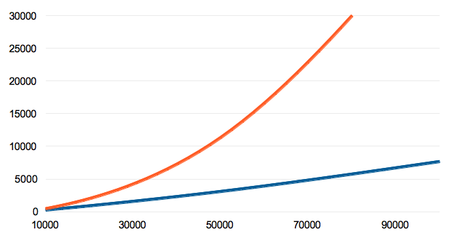

# Attacking RSA by factoring coprimes

### by Martin Wind, Gerhard Reithofer.

Algorithm by Daniel J. Bernstein http://cr.yp.to/lineartime/dcba-20040404.pdf

## Motivation

The most common asymmetric cipher currently in use is RSA. In RSA, this asymmetry is based on the practical difficulty of factoring the product of two large prime numbers, the factoring problem. 

A user of RSA creates and then publishes a public key based on the two large prime numbers, along with an auxiliary value. The prime numbers must be kept secret. Anyone can use the public key to encrypt a message, but with currently published methods, if the public key is large enough, only someone with knowledge of the prime factors can feasibly decode the message.

If one of the secret prime numbers is used in two keys the an attacker can work out the prime factor by calculating the greatest common divisor (gcd) of these keys.

~~~
n ... public key
q ... secret prime factor
p ... secret prime factor

n₀ = p₀ q₀
n₁ = p₁ q₀

gcd(n₀, n₁) = q₀
~~~

Collisions of RSA keys should never happen for realistic key sizes and good random number generators.

Assume a 1024 bit RSA key; the primes from which it has been derived are about 512 bit. If we assume every 500ths 512 bit number is a prime, and we assume the most significant bit of the 512 bit number is set, we still get about 2⁵⁰⁰ or 10¹⁵⁰ different primes. If you apply the birthday problem to these numbers then you would expect RSA keys to have a prime in common about every 2²⁵⁰ or 10⁷⁵ key generations. To put this in perspective the age of the universe is 10¹⁷ seconds.

This is large enough to never happen in practice. Unfortunately bad PRNGs which cause collisions do happen in practice.

To detect those insecure keys one could check the *gcd* of every known key. Unfortunately simply calculating every combination of public keys has an growth rate of `n(n-1)`. 

The algorithm by Daniel J. Bernstein is able to solve this problem in essentially linear time

### Runtime in seconds

| **key count** | **copri** | **n * (n-1)** |
|--------------:|:---------:|:-------------:|
|          1000 |        6  |       5       |
|          5000 |       86  |      113      |
|          1000 |      255  |      454      |
|         50000 |     2799  |     11351     |
|        100000 |     7669  |     45404     |

## Package Content

 - **[copri](copri.html)** is the C implementation of the Daniel J. Bernstein "Factoring into coprimes in essentially linear time" algorithm.
 - [app](app.html) uses the copri library and provides an simple command line interface.
 - [gen](gen.html) is a util to generate RSA keys (only the `n` values) and store these keys an raw gmp format.
 - [array](array.html) is a minimal dynamic sized array library.
 
## Download

The latest build: [copri.tar.gz](copri.tar.gz)

## Build

Requirements:

 - **scons**: software construction tool
 - **GMP**: library for arbitrary precision arithmetic
 - **OpenMP (optional)**: multithreading
 - **NodeJS and docco (optional)**: to build the documentation

On Debian or Ubuntu simply install the packages `scons`, `libgmp-dev` (and `nodejs` if you want to build the documentation). Debian and Ubuntu should ship an suitable OpenMP compiler see [openmp-compilers](http://openmp.org/wp/openmp-compilers/).

Unpack the Tarball (`tar xvzf copri.tar.gz`), enter the directory and build it by running 
`scons` without any parameters. If you want to build copri without OpenMP run `scons --no-omp`.

**Scons (Manual Installation)**

Download the [scons](http://prdownloads.sourceforge.net/scons/scons-2.3.1.tar.gz) software construction tool.

Unpack the Tarball (`tar xvzf scons-2.3.1.tar.gz`), enter the directory and install it by `python setup.py install`.

**GMP (Manual Installation)**

Download [gmp](https://gmplib.org/download/gmp/gmp-5.1.3.tar.bz2).

~~~
./configure
make
sudo make install
~~~

**Documentation (optional)**

Install [nodejs](http://nodejs.org/download/), then install docco `sudo npm install -g docco`.
Now build the Documentation `make doc`.

## Quick Start

Run `./gen -k 1024 -c 1000 p1024_x1000.lst` to generate an list of 1024bit keys or download one of our [test key lists](#key-list-download).

Then run `./app -v p1024_x1000.lst` to check the `p1024_x1000.lst` list for coprimes.

## Key List Download

- [p1024_x1000.lst](p1024_x1000.lst.gz) - 1000 1024bit keys
- [p1024_x5000.lst](p1024_x5000.lst.gz) - 5000 1024bit keys
- [p1024_x10000.lst](p1024_x10000.lst.gz) - 10000 1024bit keys
- [p1024_x50000.lst](p1024_x50000.lst.gz) - 50000 1024bit keys
- [p1024_x100000.lst](p1024_x100000.lst.gz) - 100000 1024bit keys
